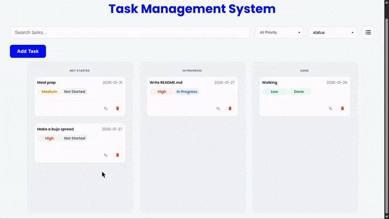

# 🎯 Task Management System

A **responsive task management application built with React**, featuring **Kanban and List views**, **drag-and-drop task movement** using **dnd-kit**, and a **mobile-first responsive UI**.  
This project was built as a **hands-on learning experience** focused on frontend fundamentals, state management, and responsive design.

## 📦 Technologies Used

- **Vite** – Fast development build tool  
- **React.js** – Component-based UI  
- **CSS** – Custom styling & media queries  
- **dnd-kit** – Drag-and-drop functionality  
- **Material UI (MUI)** – Icons, Select components, Modal UI  

## 🧩 Features

### 📝 Task Management (CRUD)

- **Add tasks**  
  Create a new task using a modal form with:
  - Task name  
  - Due date  
  - Priority level  
  - Current status  

- **Update tasks**  
  Edit existing tasks via the same modal, pre-filled with saved task data.

- **Delete tasks**  
  Remove tasks directly from the task card.

- **Persistent storage**  
  Tasks are saved in **localStorage**, so data remains after refreshing the page.

### 🔍 Search, Filter & Sort

- **Search tasks** by typing in the search bar  
- **Filter tasks** by priority level  
- **Sort tasks** by:
  - Due date  
  - Priority  
  - Status  

### 🧩 Views & Interaction

- **Kanban View**  
  Tasks are grouped by status and can be moved between columns using drag-and-drop.

- **List View**  
  Displays all tasks in a structured list format.

- **View toggle**  
  Switch between Kanban and List views using an icon button.

- **Drag & Drop**  
  Drag tasks between statuses — the task status updates automatically on drop.

### 📱 Responsive Design (Half-Desktop / Tablet / Mobile)

- **Hamburger menu & sidebar**  
  On smaller screens, filters and sorting options are moved into a sidebar accessible via a hamburger menu.

- **Mobile-friendly UI**  
  Layouts adapt smoothly across:
  - Half-desktop screens  
  - Tablets  
  - Mobile devices  

- **Material UI Select & Modal**  
  Native HTML select elements were replaced with MUI components for improved responsiveness and usability.

## 👩🏽‍🍳 Development Process

1. Implemented **core CRUD functionality** using a simple list view.  
2. Added **localStorage** for task persistence.  
3. Introduced a **modal-based form** for adding tasks.  
4. Reused the same modal for editing tasks via **conditional rendering**.  
5. Implemented **filtering and sorting** using a reusable Select component.  
6. Added **Kanban view** and a toggle for switching layouts.  
7. Integrated **drag-and-drop** using `dnd-kit`.  
8. Focused on **responsive design** with media queries and layout adjustments.  
9. Migrated key UI elements to **Material UI** for better cross-device support.

## 📚 What I Learned

- Implementing drag-and-drop interactions using **dnd-kit**  
- Managing UI state efficiently in **React**  
- Creating **reusable components**  
- Building **responsive layouts** with CSS media queries  
- Improving usability with **Material UI**  
- Persisting data using **localStorage**

## 💭 Future Improvements

- **Habit Tracker Feature**
  - Custom habit durations  
  - Visual progress tracking  

- Optional enhancements:
  - Dark mode  
  - Task categories or tags  
  - Cloud-based persistence (Firebase or backend API)

## 🚦 Running the Project

Follow these steps to run the project locally:

1. **Clone the repository** 

```bash 
git clone https://github.com/sithulikaluarachchi/Task-Management-Web-App.git 
```

3. **Install dependencies** 

```bash
npm install
```
4. **Start the development server** 
```bash
npm run dev
```

## Demo
 **Live** :- https://task-management-web-app-umber-three.vercel.app/

  

 


